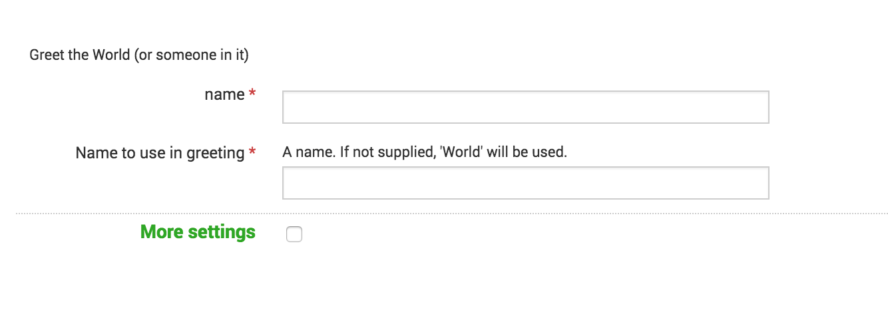

# Simple modular input

This simple modular input does not use the
Splunk SDKs, but still includes validation and configuration. It's
a simple Hello World that demonstrates how Splunk Enterprise integrates
with external processes to allow input of arbitrary data.

## Configuration

First we need to tell Splunk Enterprise about our modular input. You are probably
familiar with our conf system at this point and how it allows control
over the behavior and extension of Splunk Enterprise. For a modular input, we
need to not only configure Splunk Enterprise, we also need to extend the conf system
to allow it to interpret configuration files on our behalf.

Splunk configures inputs in a file not surprisingly named `inputs.conf`. With
a modular input that can pull data from absolutely anywhere, Splunk Enterprise needs
hints about what configuration data for the input is going to look like.
While the input itself can appear in $SPLUNK_HOME/etc/system/local or in 
the /local or /default directories of an app, the meta-configuration goes
into a file named /README/inputs.conf.spec in the root of your app.

In inputs.conf.spec create a stanza that will describe how your input will be
configured in an inputs.conf file. The naming format looks similar to a URI
scheme where your input takes the name of a protocol. In our example
we called it 'hello', so your stanza is `[hello://<input_name>]` In
our case we only have a single value (a name to use when creating events), so
the only configuration we have is a single attribute that we specify with
`name_to_greet = <value>`.

When we create an actual input it will look like:

    [hello://greet_joe]
    name_to_greet = joe

You can see what it's going to look like in the GUI here:



## Script

Since we named our scheme hello, Splunk Enterprise is going to expect to find a script
named hello or hello.py in the /bin directory of your app. The name of the
script can be changed, but we will use the default.

A modular input script can be run in three modes; a scheme mode that 
supplies Splunk Enterprise with data on how the script is run and how to interpret
inputs and outputs, a run mode, and an optional validate mode that allows
custom validation of a script's inputs. These three modes are specified by
command-line arguments to the script.

When run with --scheme, Splunk Enterprise expects the script to return an XML payload 
on stdout that describes how the script will run. Remember that it will only
be run on registration of the modular input. Splunk Enterprise will not run the script
with the --scheme argument again until it reinitializes the input. Some elements
of the scheme are particularly useful and we will revisit the format in more
detail later in the Validation and Explain yourself sections.

When the scheme returned by the script includes the `use_external_validation` 
option the script will be run with `--validate-arguments` 
a user configures an input using the scheme and specification for the modular input.
The parameters for the input specification will be supplied in XML on stdin.
If the script returns normally, the input will be saved normally.  If the script
returns a non-zero exit code, the save process will be aborted. The script 
can return a message by returning an XML payload on stdout. We will talk more
about this below in the validation section.

In run mode the input script does not receive a command-line argument.
Splunk Enterprise supplies the input's parameters
in an XML format on stdin and expects a stream of events on stdout. The events can
be supplied in two ways. In simple streaming, output from the script is 
treated like Splunk Enterprise treats a file or a network input, by default breaking
each line into an event. If the streaming_mode parameter on the scheme
is set to `xml`, Splunk Enterprise expects an XML document on stdout.

The advantages to specifying XML streaming are many. It allows you to deal
with your own event breaking, so multiline events are not an issue.  It 
allows you to specify the index time (_time) for the event and override 
the default index, sourcetype, or source for the event. The output for your
script should look something like this:

```{xml}
<stream>
  <event>
    <data>This is my data here</data>
  </event>
</stream>
```

Optionally you can supply `<time>`, `<source>`, `<sourcetype>` and `<index>`
tags within the event as well.

## Validation

Modular inputs are designed to bring any sort of data into Splunk Enterprise. To configure
a program with that much flexibility, we need some flexibility in validating the
input configuration.

There are two ways  to validate an input configuration using a modular input. 
The first is by supplying `validation` arguments within a scheme. This is the 
clearest and easiest method, but it has limitations. It is great for validations 
where we can check the setting against a regular expression, ensure that the 
value is numeric, or even that it matches a valid TCP port. But it can not help 
with ensuring that an API key is valid or that a domain is reachable. 

For dynamic checks we accept the --validate-args command. The script is supplied
with the configuration for the input, and then we can try the values. If they 
don't work, exit from the script with a non-zero return value. It is best to also
return a reason for the validation failure by supplying an XML document to stdout
like this:

```{xml}
<error>
  <message>API token has been revoked</message>
</error>
```

You can try this out in our example- try adding a hello input that greets someone
named Fred.

## Explain yourself

Modular inputs can be complicated, and so they can be challenging to administer.
To help your users out, do your best to explain what the different options are
in your input. Use validation to give clear error messages, but also document
your arguments in your scheme. Each argument not only has a name, it can also
have a title and a description. You can also supply a custom interface for 
configuring your input, allowing for instant validation as your user supplies
values.

